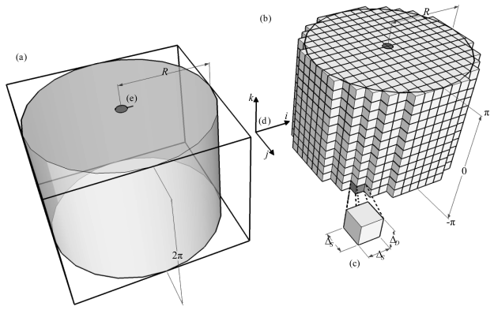
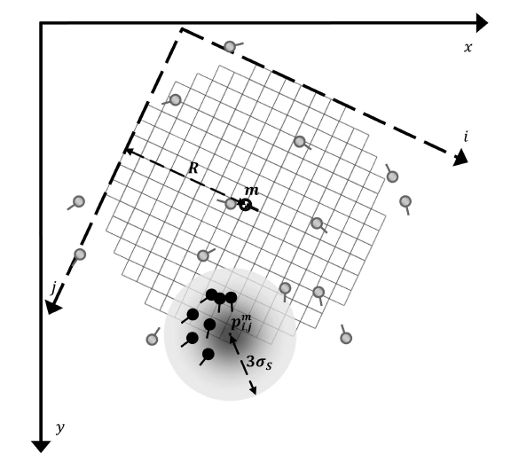
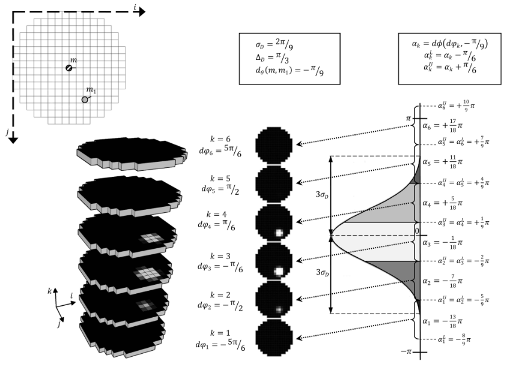

## Fingerprint Indexing Based on Novel Features of Minutiae Triplets

### Introduction and Related Research

> Verification: Compares query with claimed target
> 
> Identification: Search for target that best matches query in database

Efficient identification of fingerprints is still a challenging problem, since the size of the fingerprint image database can be large and there can be significant distortions (geometric distortions, occlusion and clutter) between different impressions of the same finger.

Approaches to fingerprint identification:
1) repeat the verification procedure for each fingerprint in the database, 
2) fingerprint classification, and
3) fingerprint indexing.

The first is impractical for large databases. 

The second tries to classify fingerprints into a small number of classes. FBI has defined 8 classes and researchers have proposed 5 classes RLWAT (Right Loop, Left Loop, Whorl, Arch, Tented Arch). The problem with this approach is that the number of classes is small and the classes are not evenly distributed.

The goal of the third approach, called indexing, is to significantly reduce the number of candidate hypotheses to be considered by the verification algorithm. For multidimensional indexing methods, readers are referred to a survey article by [Gaede and Gunther [14]](https://dl.acm.org/doi/abs/10.1145/280277.280279).

A prominent approach for fingerprint indexing is by Germain et al. [4]. They use the triplets of minutiae in their indexing procedure. The features they use are: the length of each side, the ridge count between each pair of vertices, and the angles that the ridges make with respect to the X-axis of the reference frame. The problems with their approach are: 

1. the length changes are not insignificant under shear and other distortions, 
2. ridge counts are very sensitive to image quality, 
3. the angles change greatly with different quality images of the same finger, and 
4. uncertainty of minutiae locations is not modeled explicitly.

### Technical Approach

Offline stage: Extract minutia one-by-one and construct model database.

Online stage: Perform the same minutia extraction.

The following features are derived from the triangle formed by each noncollinear triplets of minutiae to form index $H(\alpha_{\min}, \alpha_{\text{med}}, \phi, \gamma, \eta, \lambda)$

- $\alpha_{\min}$: the smallest angle of the triangle
- $\alpha_{\text{med}}$: the median angle of the triangle (180 - sum of the other two angles)
- $\phi$: triangle handedness, $\phi = \text{sign}\left(\overrightarrow{P_1P_2} \times \overrightarrow{P_2P_3}\right)$
- $\gamma$: Triangle type, each minutia point $P_i$ is associated with an endpoint or a bifurcation. If $P_i$ is an endpoint, $\gamma_i = 1$, otherwise $\gamma_i = 0$. Then $\gamma = 4\gamma_1 + 2\gamma_2 + \gamma_3$
- $\eta$: triangle direction
- $\lambda$: maximum side, $\max\left\{\|P_1P_2\|, \|P_2P_3\|, \|P_3P_1\|\right\}$

Suposição

$$\text{Pr}(I = I_i | m \in (M \cap M_i)) \propto r$$

- $I$, $I_i$: fingerprint images
- $m$: minutia
- $M$, $M_i$: minutia sets
- $r$: number of triangles in $I_i$ that includes $m$

> Construída a feature, faz a busca.

## Minutia cylinder-code: A new representation and matching technique for fingerprint recognition

Local minutia matching: refer to Handbook of Fingerprint Recognition.

Local Minutia Structures: 
- Nearest Neighbor: Select the K nearest minutiae to the central minutia.
- Fixed Radius: Select all minutiae within a fixed radius of the central minutia. (more tolerant to spurious or missing minutiae)

### 3.1 The Cylinder of a Given Minutia

Cylinder with radius $R$ and height $2\pi$, whose base is centered on the minutia location $(x, y)$. The cylinder is aligned to the minutia direction $\theta$. The cuboid enclosing the cylinder is then discretized.

> Intervenção:

Defina:

1. Cada célula do cuboide é indexada por $(i, j, k)$. Sendo $i$ e $j$ no intervalo entre $1$ e $N_s$ e $k$ no intervalo entre $1$ e $N_d$.
2. O nível de discretização horizontal é $\Delta_s = 2R/N_s$ e o nível de discretização vertical é $\Delta_d = 2\pi/N_d$.
3. Para cada nível de altura ($k$) é associada uma rotação
    $$d\varphi_k = (k - 1/2)\Delta_d-\pi$$
4. O centro da célula $(i, j)$, independente do nível, é dada por
    $$p_{i, j}^m = (x, y) + \mathbf{R}_\theta\left(i - \frac{N_s+1}{2}, j - \frac{N_s+1}{2}\right)\Delta_s$$
    sendo $\mathbf{R}_\theta$ a matriz de rotação.

Para preencher o cilindro, aplique os seguintes passos:

1. Cada célula $(i, j, k)$ recebe o valor da função $C_m(i, j, k)$, 
2. A função $C_m(i, j, k)$ pega todas as minúcias ao redor do ponto centrado em $(i, j)$ e avalia a contribuição de cada uma.
3. Definimos esse conjunto de minúcias vizinhas de $p_{i, j}^m$ como
    $$N_{p_{i, j}^m} = \{m_t | m_t \neq m, d(m_t, p_{i,j}^m) \le 3\sigma\}$$
4. A avaliação da função é
    $$C(i,j,k) = \begin{cases}
    \Psi\left(\sum_{m_t \in N_{p_{i, j}^m}} C^S \cdot C^D\right),\quad \xi(p_{i,j}^m) = 1\\
    \\
    \text{undefined},\quad \text{otherwise}
    \end{cases}$$

    $\Psi$ é uma sigmoide $\Psi(x) = \frac{1}{1+e^{-\tau(x - \mu)}}$, $\xi(p_{i,j}^m)$ é uma função indicadora que verifica se a célula $(i, j, k)$ está na interseção do cilindro com o convex hull da impressão digital.

    $$\xi(p) = \begin{cases}
    1, \text{se } p\in \Big[d(m, p) \le  R\cap \text{ConvHull}(T)\Big]\\
    0, \quad\text{otherwise}
    \end{cases}$$

    sendo $T$ o conjunto de minúcias da impressão digital. Isso é importante para não avaliar partes do cilindro que estão fora da impressão digital.
5. Por fim, os termos $C^S\cdot C^D$ é só uma abreviação para:
    $$C^S_m(m_t, p_{i, j}^m)\cdot C_m^D(m_t, d\varphi_k)$$
    que representam respectivamente as contribuiçãos espaciais e direcionais da minúcia $m_t$, respectivamente.

    $$C^S_m(m_t, p_{i, j}^m) = \frac{1}{\sigma\sqrt{2\pi}}\exp\left(-\frac{t^2}{2\sigma^2}\right)$$

    $$C^D=\text{conta envolvendo ângulos} ...$$

A contribuição espacial é vista na imagem abaixo

A contribuição direcional é vista na imagem abaixo

### 3.2 Creation of a Cylinder-Set

Para cada fingerprint, um cilindro é criado para cada minúcia.
 
 O conjunto de cilindros válidos (número pequeno de células, existem poucas minúcias que originam o cilindro) é chamado de $CS$.

### 3.3 The Similarity between Two Cylinders

Linearizar o cilindro (transformar em um vetor) $C_m(i, j, k) \to \mathbf{c} \in \mathbb{R}^{N_C}$, com $N_C = N_S\times N_S\times N_D$

Sejam os vetores $\mathbf{c}_a$ e $\mathbf{c}_b$ obtidos dos cilindros das minúcias $a$ e $b$.

A função de similaridade é

$$\gamma(a, b) = 1 - \frac{\|\mathbf{c}_{b|a} - \mathbf{c}_{b|a}\|}{\|\mathbf{c}_{b|a}\|+\|\mathbf{c}_{a|b}\|}$$

Sendo $\mathbf c_{b|a}$ as componentes de $b$ onde ambos vetores tem entradas válidas (células válidas do cilindro). As entradas onde um dos vetores é $\text{undefined}$ recebem valor nulo.

### 3.4 Bit-Based Implementation

### 4. Global Score and Consolidation

In order to compare two fingerprints, a single value (global score) denoting their overall similarity has to be obtained

- Defino dois templates de minúcia $A$ e $B$.
- Defino uma medida de similaridade entre as minúcias $\gamma: A\times B \to [0, 1]$
- Todas as possíveis similaridades podem ser agrupadas em uma matriz
    $$\Gamma\in [0, 1]^{|A|\times |B|}$$
    $$\Gamma[i, j] = \gamma(a_i, b_j)$$

> Um método de indexação poderia aliviar o fardo computacional para construir $\Gamma$, já que ela compara todos contra todos.

### 4.1 Local Similarity Sort (LSS)

Ordene as top $K$ similaridades locais para cada minúcia e encontre a média.

O valor de $K$ pode ser ajustado.

### 4.2 Local Similarity Assignment (LSA)

Aplica o algoritmo húngaro.

### 4.3 Local Similarity Sort with Relaxation (LSSR)

...

## Fingerprint Indexing Based on Minutia Cylinder-Code

This led some researchers to investigate retrieval systems that are not based on exclusive classes, but represent each fingerprint in a robust and stable manner so that, in the search phase, it is possible to select the most similar candidates according to such a representation. In the last decade, several fingerprint indexing techniques have been proposed; most of the approaches can be roughly classified on the basis of the features used.

- Global features
- Local ridge-line
- Minutias: (triples)
- Others: SIFT

### Minutia Cylinder-Code (MCC)

ISO/IEC 19794-2 minutia template: $m = \{x, y, \theta\}$ (position and rotation).

Now for each minutia $m$, a local structure is associated:

The cylinder is divided into discretized sections, each section corresponds to a direction difference in the range $[-\pi,\pi]$.