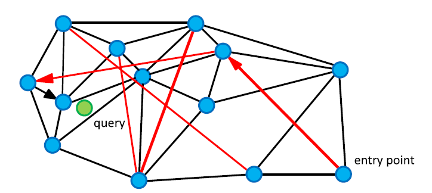

# Approximate nearest neighbor algorithm based on navigable small world graphs

Massively distributed systems like BitTorrent or Skype are based on distributed hash tables.

*The problem*: We need to find the set of $k$ closest objects $P\subseteq X$ from a finite set of objects $X\subseteq \mathcal{D}$ to a given query $q\in \mathcal{D}$, where $\mathcal{D}$ is the set of all possible objects (data domain). Closeness or proximity of two objects $o', o'' \in \mathcal{D}$ is defined as a distance function $\delta(o', o'')$

*Naïve solution*: calculate the distance function $δ$ between $q$ and every element from $X$. This leads to linear search time complexity, which is much worse than the scalability of structures for exact match search, and makes the naïve version of k-NNS almost impossible to use for large size datasets.

*Proposed solution*: a data structure represented by a graph $G(V, E)$, where every object $o_i$ from $X$ is uniquely associated with a vertex $v_i$ from $V$. Searching for the closest elements to the query $q$ from the data set $X$ takes the form of searching for a vertices in the graph $G$.

One of the basic vertex search algorithms in graphs with metric objects is the greedy search algorithm. It has a simple implementation and can be initiated from any vertex. In order for the algorithm to work correctly (always return precise results), the network must contain the Delaunay graph as its subgraph, which is dual to the Voronoi tessellation (voronoi:aurenhammer1991). However, there are major draw- backs associated with the Delaunay graph: it requires some knowledge of metric space internal structure (searching:navarro2002) and it suffers from the curse of dimensionality (voronoi:aurenhammer1991). More- over, for the applications described above, the precise exactness of the search is not required. So the problem of finding the exact nearest neighbors can be substituted by the approximate nearest neighbor search, and thus we do not need to support the whole/exact Delaunay graph.

Graphs with logarithmic scalability of the greedy search algorithm are called navigable small world graphs, they are well known in Euclidean spaces.


Presented algorithms do not use the coordinate representation and do not presume the properties of Euclidean spaces, because they are based only on compar- ing distances between the objects and the query, and therefore in principle are applicable to data from general metric (or even non-metric) spaces. 

### Related Work

Kd-tree [15] and quadra trees [16] were among the first works on the kNN problem. They perform well in 2–3 dimensions (search complexity is close to Oðlog nÞ in practice), but the analysis of the worst case for these structures [17] indicates $O(d^\ast N^{1-1/d})$ search complexity, where $d$ is the dimensionality.

In (searching:navarro2002) was proposed an exact-proximity search structure that uses the Delaunay graph with the greedy search algorithm. Authors showed the impossibility of finding the exact Delaunay graph in a general metric space, and to keep the search exact they resort to back- tracking. Proposed data structure has construction time $O(n \log^2 n/\log\log n)$ and search time $O(n^{1-\Theta(1/\log\log n)})$ in high dimensions and $O(n^\alpha)$, $0 < \alpha < 1$ in low dimensions.

In general, currently there are no methods for effective exact NNS in high-dimensionality metric spaces. The reason behind this lies in the “curse” of dimensionality (searching:chavez2001). To avoid the curse of dimensionality while retaining the logarithmic cost on the number of elements, it was proposed to reduce the requirements for the kNN problem solution, making it approximate (Approximate kNN).

Two classes of Approximate kNN
- $\epsilon-NNS$, the distance between the query and any element in the result in no more than $1+\epsilon$ times the distance between the query to its true k-th nearest neighbor.
- Recall based, probability guarantee of finding true k closest point to the query (the fraction of true k nearest neighbors in the result set).

### Core idea

It is important to note that links (edges) in the graph serve two distinct purposes:
1) There is a subset of short-range links, which are used as an approximation of the Delaunay graph [7] required by the greedy search algorithm.
2) Another subset is the long-range links, which are used for logarithmic scaling of the greedy search. Long-range links are responsible for the navigation small world properties of the constructed graph [9]



### Search Algorithm

```python
def greedy_search(q: object, vep: vertex):
    vcurr = vep # v_entry point
    dmin = d(q, vcurr)
    vnext = None

    # Goes through all the neighbors of the current vertex
    for vfriend in vcurr.friends():
        dfriend = d(q, vfriend)
        if dfriend < dmin:
            # If the distance to the friend is less than the current minimum distance, updates the next candidate
            dmin = dfriend
            vnext = vfriend
    
    if vnext is None:
        return vcurr
    else:
        return greedy_search(q, vnext)
```

```python
def KNNSearch(q: object, m: integer, k: integer):
    ep = random.choice(V)
    candidates.append(ep)
    
    while True:
        c = getClosest(candidates, q)

        if d(q, c) > d(q, result[k]):
            break
        
        for v in c.friends():
            if v not in visited:
                visited[v] = True
                candidates.append(v)
                tempResult.append(v)
    
    #add tempResult to result
    #select the k-th closest object from result
```

### Data insertion

We propose to assemble the structure by inserting elements one by one and connecting them on each step with the f closest objects which are already in the structure. Our approach is based on the idea that intersection of the set of elements which are Voronoi neighbors and the f closest elements should be large.

```python
def NNinsert(new: object, f: int, m: int):
neighbors = KNNSearch(new, m, f)
for v in neighbors:
    connect(new, v)
```

# Efficient and Robust Approximate Nearest Neighbor Search Using Hierarchical Navigable Small World Graphs

## Introduction

Busca de dados não estruturados via K-Nearest Neighbor Search (KNSS). Não é prática a implementação da busca linear de complexidade $O(n)$ para grandes datasets. Isso fomentou a busca por algoritmos mais eficientes.

Algoritmos de busca exata funcioname só para casos de baixa dimensionalidade, por conta da "maldição da dimensionalidade". Para superar esse problema, foi preciso relaxar a condição de busca exata, permitindo um nível de erro na busca, dando origem aos métodos de K-Approximate Nearest Neighbor Search (K-ANNS). A qualidade desses métodos pode ser medida com relação ao *recall* que é a razão entre os vizinhos verdadeiramente mais próximos e o total de vizinhos encontrados. As soluções de K-ANNS são:
- Baseado em árvores [6, 7]
- Locality Sensitive Hashing (LSH) [8, 9]
- Product Quantization [10...17]
- Proximity Graphs [10, 18...26]

Os métodos baseados em grafos tem se mostrado eficientes em casos de alta dimensionalidade. Entretanto, a escalabilidade do roteamento desses grafos é ditada por leis de potência, prejudicando a performance desses métodos em cenários com dimensionalidade baixa ou dados clusterizados.

## Related Works

### Proximity Graph Techniques

Os algoritmos baseados em grafos estão baseados em um roteamento guloso em um grafo de proximidades. Para um dado grafo, o ponto inicial é escolhido (aleatoriamente ou usando alguma heurística) e de forma iterativa o grafo é percorrido: 
- distâncias de todos os vizinhos do nó atual são computadas;
- seleciona o vizinho mais próximo para ser visitado;
- armazena uma lista com os melhores vizinhos encontrados (com relação a distância)

Nesses grafos de proximidade, 'k-NN graphs', os links para os vizinhos mais próximos servem como uma *aproximação* de um grafo de Delaunay (um grafo que garante que o resultado de uma busca gulosa são os vizinhos mais próximos). A construção desse grafo não pode ser feita de forma efetiva sem conhecimento estrutural do espaço, mas a aproximação pode ser obtida usando somente distâncias entre vizinhos.

O problema dos grafos k-NN:
1) Power law scaling no número de passos de roteamento baseado no tamanho do dataset,
2) Perda de conectividade global que degrada resultados em datasets com clusters.

Uma outra solução é o algoritmo de Navigable Small World (NSW) que usam grafos *navegáveis* (grafos com escala logarítmica ou polilogarítmica no número de saltos com relação ao tamanho da rede). Um NSW é construído inserindo de forma consecutiva elementos e os conectando aos $M$ mais próximos. Aqui é necessário a busca desses $M$ mais próximos, que é realizada via busca gulosa com múltiplos entry-points aleatórios. Os links formados nas etapas iniciais tornam-se pontes para diferentes regiões, que permitem conectividade e escala logarítimica.

A construção pode ser paralelizada que é uma vantagem. No entanto, a escala polilogarítimica mostra degradação em cenários de baixa dimensionalidade.

### Navigable Small World Models

Redes com roteamento logarítimico ou polilogarítimico são conhecidas como *small world networks*.

Primeiros trabalhos que consideraram modelos espaciais de small world networks foram feitas por J. Kleinberg. O mesmo autor estudando redes aleatórias Watts-Strogatz mostrou que com links distribuídos com $r^{-d}$, sendo $d$ a dimensão do espaço, o número de saltos para alcançar um destino de forma gulosa é polilogarítmico. Essa ideia inspirou muitos algoritmos baseados nessa extensão de navigabilidade. A limitações do modelo envolvem: para construir essa rede é preciso conhecer a distribuição dos dados a priori e não é possível superar o efeito polilogarítmico.

O NSW mostrado anteriormente é mais simples, pode ser construído de forma descentralizada e em espaços arbitrários.

## Motivation

Para melhorar o roteamento de NSW foi observado que ele pode ser dividido em duas etapas:
- zoom-out: Aqui que a busca gulosa começa, de um nó com baixo grau para nós com grau mais elevado. Isso pode ser evitado começando a busca de um NSW em um nó de alto grau (aqueles mais antigos), direto na etapa de zoom-in
- zoom-in: alto grau.

Qual a razão do roteamento polilogarítmico?
1. O número de cálculos de distâncias é proporcional ao produto
    $$\text{calc. distancia} \propto \langle\text{\# hops}\rangle\langle\text{node degree}\rangle$$
    aqui denotando o número médio por $\langle\cdot\rangle$.
2. $\langle\text{\# hops}\rangle$ é logaritmico, vide [26, 44]
3. $\langle\text{node degree}\rangle$ também é logartimico. Razões discutidas no texto original.

A proposta do HNSW é dividir links em camadas, baseado nos seus comprimentos. O roteamento é feito de maneira gulosa até um mínimo local em cada nível, seguindo para a próxima camada com esse mínimo local como ponto de entrada.


Cada elemento inserido realiza uma amostra de uma distribuição geométrica, que fornece o valor de $l$ que define a maior camada em que estará presente. Toda camada é construída de forma incremental como um grafo de proximidade (aproximação de um grafo de Delaunay).

Para definir as conexões é utilizada uma heurística diferente dos elementos mais próximos. 

> (RNG*?) que ele fala no podcast

## Algorithm Description

```python
def search_layer(q: object, ep: list[vertex], ef: int, lc: int):
    visited = ep
    candidates = ep
    found = ep
    while len(candidates) > 0:
        c = getClosest(candidates, q)
        f = getFarthest(found, q)
        if d(q, c) > d(q, f):
            break
        for v in c.neighbors():
            if v not in visited:
                visited.append(v)
                f = getFarthest(found, q)
                if d(q, v) < d(q, f) or len(found) < ef:
                    candidates.append(v)
                    found.append(v)
                    if len(found) > ef:
                        found = removeFurthest(found, q)
    return found
```

Para obter os `ef` vizinhos mais próximos em uma dada camada é iniciada uma lista dinâmica dos vizinhos, chamada no código de `found` (inicialmente com os pontos de entrada). Essa lista é atualizada ao consultar toda a vizinhança do elemento mais próximo ainda não avaliado

```python
def insert(hnsw: HNSW, q: object, M: int, Mmax: int, efConstruction: int, mL: int):
    found = []
    ep = hnsw.getEntryPoint()
    L = hnsw.levels

    l = floor(-log(random()) * mL) # Sample element level

    for lc in range(L, l, -1):
        # Para cada nível acima do nível do elemento, busca o mais próximo
        found = search_layer(q, ep, ef=1, lc)
        ep = found[0]
    
    for lc in range(0, min(L, l), -1):
        # Nos níveis onde o elemento está presente...
        found = search_layer(q, ep, efConstruction, lc)
        neighbors = select_neighbors(q, found, M, lc)

        connect(q, neighbors) # Cria as ligações

        for n in neighbors:
            nConn = n.neighbors()
            if len(eConn) > Mmax:
                n.neighbors = select_neighbors(n, nConn, Mmax, lc)

        ep = found
    
    if l > L:
        hnsw.levels = l
        hnsw.setEntryPoint(q)
```

Primeira fase: Começa dos níveis acima do valor de $l$. Nesse níveis, é feita uma busca gulosa para obter o elemento mais próximo de $q$ (aqui poderia ser escolhido múltiplos elementos aumentando o valor de `ef`).

Segunda fase: Quando o nível chegou em $l$ ou menor. Aqui o parâmetro `efConstruction` é escolhido como maior que 1, controlando a qualidade. Os vizinhos encontrados em cada nível são usados para formar a melhor conexão usando a heurística `select_neighbors`, sendo que $M$ controla o número de conexões feitas.

A heurística para escolher os $M$ melhores é dada a seguir.

```python
def select_neighbors(q: object, candidates: list, M: int, lc: int, extendCandidates: bool, keepPrunned: bool):
    result = []
    queue = candidates

    if extendCandidates: # Aumenta a busca para os vizinhos de segundo grau
        for c in candidates:
            for n in c.neighbors():
                if n not in queue:
                    queue.append(n)
    
    discarded = []
    while len(queue) > 0 and len(result) < M:
        nearest = queue.pop(0)
        if d(nearest, q) < d(result[-1], q):
            result.append(nearest)
        else:
            discarded.append(nearest)
    
    if keepPrunned:
        while len(discarded) > 0 and len(result) < M:
            result.append(discarded.pop(0))
    
    return result
```
        